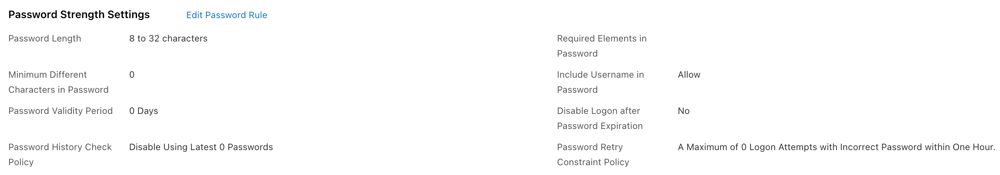
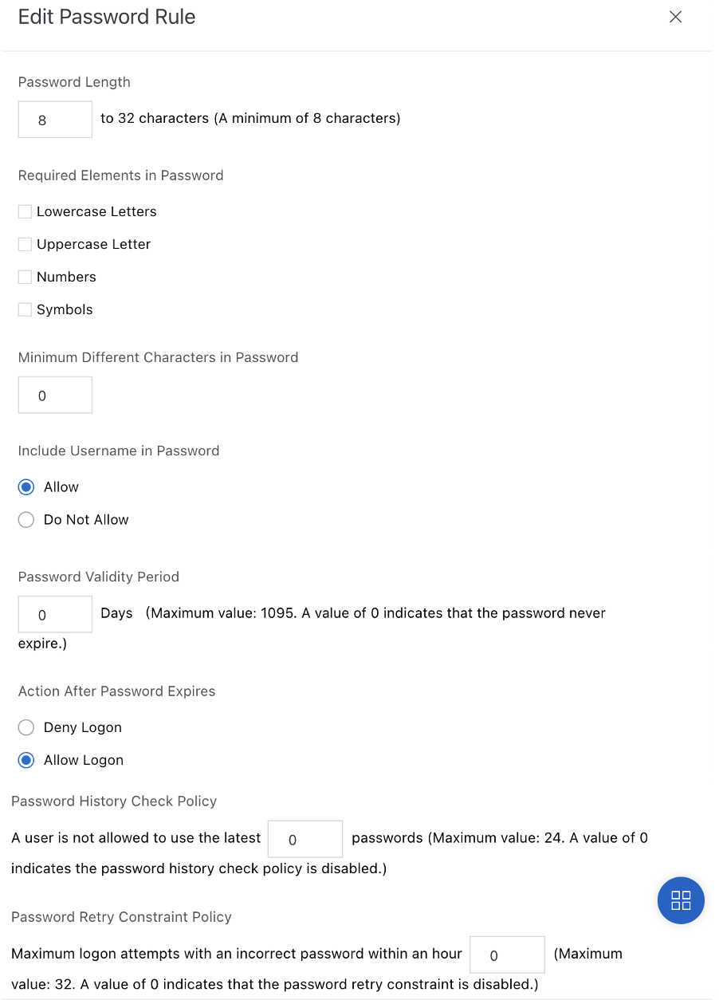

To change the password policy:

-   Go to the RAM console,

-   Click on Settings,

-   Click on Edit Password Rule next to the text Password Strength
    Settings,

-   Change information,

-   Click on OK.

