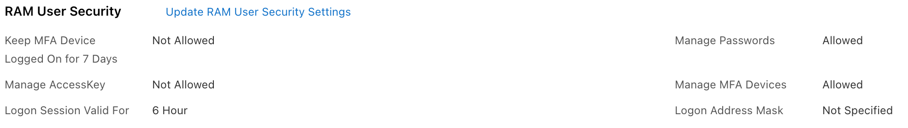
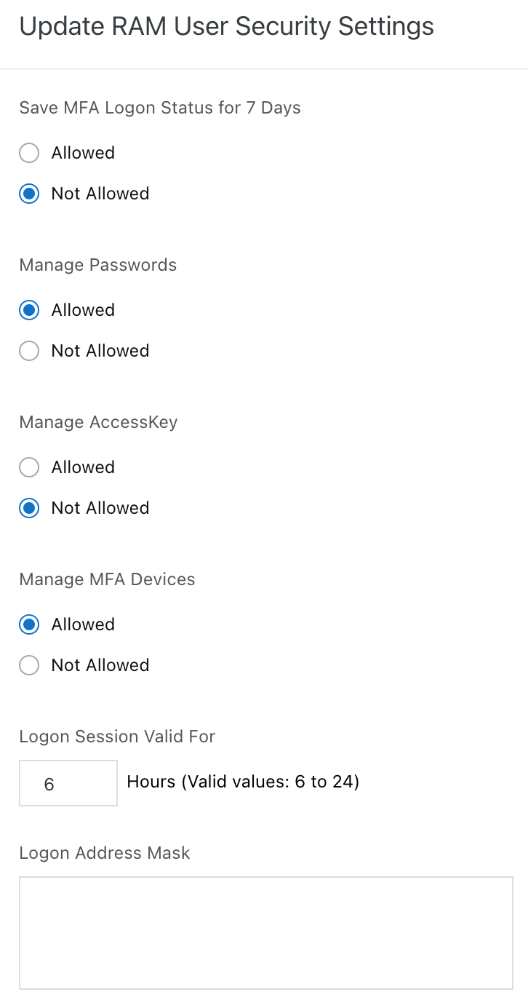

To change the security configuration:

-   Go to the RAM console,

-   Click on Settings,

{width="4.5in" height="0.6347222222222222in"}

-   Click on User RAM User Security Settings,

-   Enter the information,

-   Click on Save Changes.

{width="1.5659853455818022in"
height="2.9635990813648294in"}
