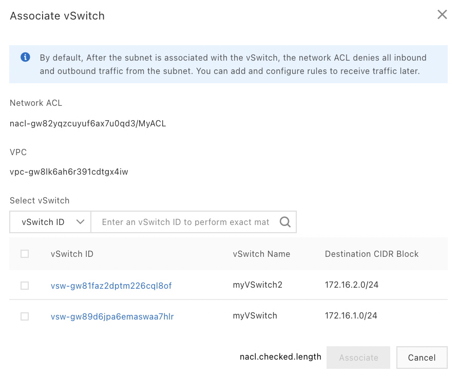

To associate a network ACL with a vSwitch:

-   Go to the VPC console,

-   Click on ACL \| Network ACL,

-   Select a region,

-   Click on Associate vSwitch on the NACL line,

-   Click on the Resources tab,

-   Click on Associate vSwitch,

-   Select the vSwitch,

-   Click on Associate.

