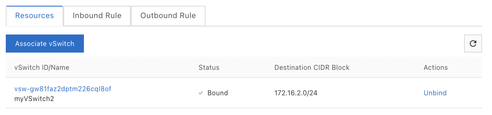

To unlink a network ACL from a vSwitch :

-   Go to the VPC console,

-   Click on Network ACL,

-   Select a region,

-   Click on Associate vSwitch on the NACL line,

-   Click on the Associate vSwitch tab,

-   Click on Unbind on the vSwitch line,

-   Click on OK.

{width="4.172802930883639in"
height="0.9768733595800525in"}
