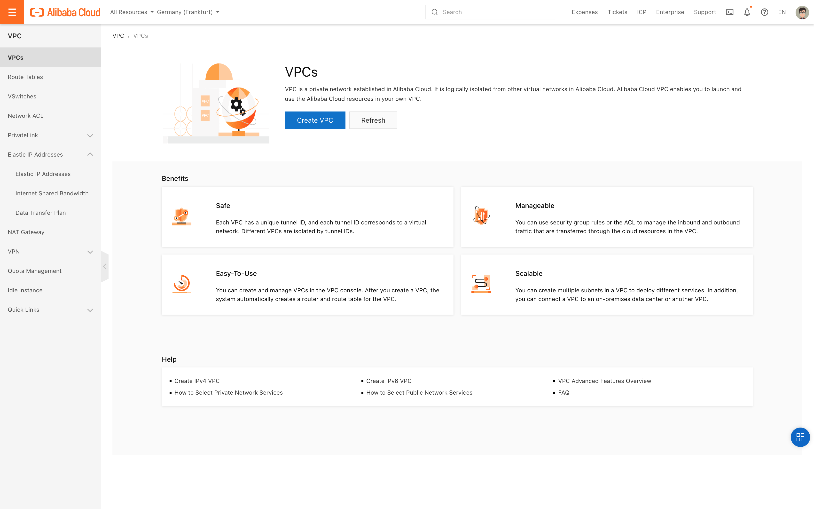
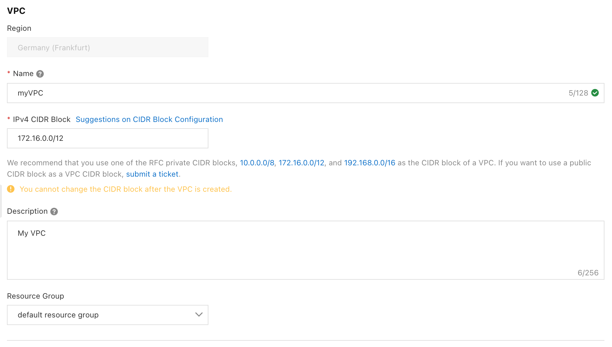
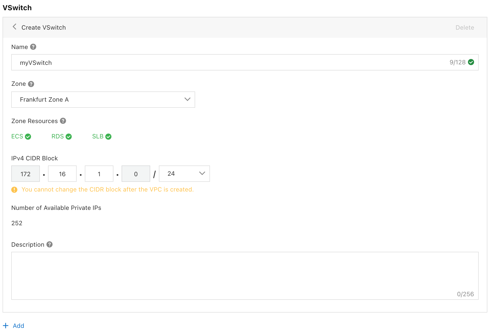

# VPC
### TASK : Create a VPC

Go to the VPC console

Select the region

Click on `VPCs`

Click on `Create VPC`

Enter the name of the VPC

Refer to the CIDR

Possibly enter the description,

Click on `OK`

