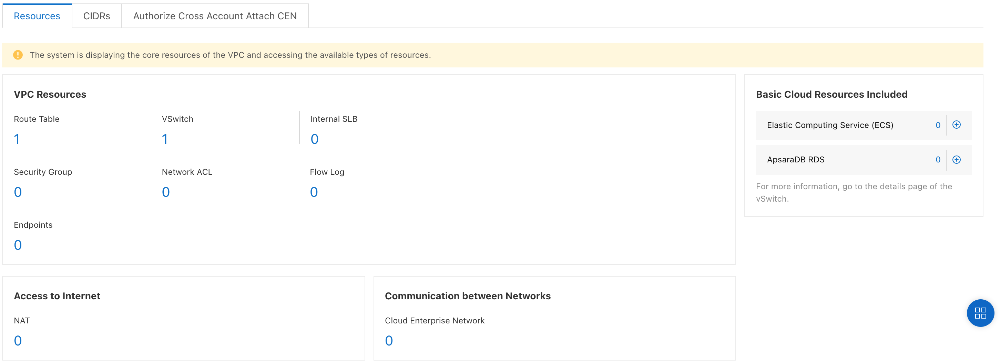

To view information about a VPC:

-   Go to the VPC console,

-   Click on VPCs,

-   Select the region,

-   Click on the instance ID.

The basic information about the VPC is displayed: name, ID, status,
region, CIDR, default VPC, creation date and time, \...

{width="4.5in" height="1.69375in"}

{width="4.5in" height="1.6402777777777777in"}
